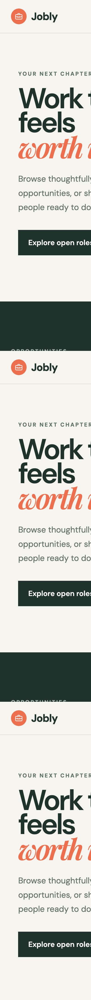

# Jobly — Spring Boot CRUD Job Portal

A full-stack job board that demonstrates basic CRUD operations using a Spring
Boot REST API and a responsive React frontend. Users can browse available jobs,
publish a new job, and delete an existing job through a clean, focused interface.



## Features

- View all available job posts
- View an individual job through the REST API
- Add a new job from the React form
- Update an existing job through the REST API
- Delete a job from the website
- Responsive layout for desktop, tablet, and mobile
- Loading, success, empty, and error states
- Vite development proxy connecting React to Spring Boot

## Tech stack

| Layer | Technology |
| --- | --- |
| Frontend | React 19, Vite, CSS |
| Backend | Java 25, Spring Boot 4.1 |
| API | Spring Web MVC, REST, JSON |
| Data | In-memory Java `ArrayList` |
| Build tools | Maven, npm |

## REST API

The Spring Boot `RestController` exposes the CRUD operations below:

| Method | Endpoint | Operation |
| --- | --- | --- |
| `GET` | `/jobPosts` | Get all jobs |
| `GET` | `/getJob/{id}` | Get one job by ID |
| `POST` | `/getJob` | Create a new job |
| `PUT` | `/getJob` | Update an existing job |
| `DELETE` | `/getJob/{id}` | Delete a job by ID |

Example job payload:

```json
{
  "postId": 6,
  "postProfile": "Backend Developer",
  "postDesc": "Build reliable services with Java and Spring Boot.",
  "reqExperiance": 3,
  "postTechStack": ["Java", "Spring Boot", "REST"]
}
```

## How it works

```text
React UI (localhost:5173)
        │
        │  /api/jobPosts and /api/getJob
        ▼
Vite development proxy
        │
        │  removes the /api prefix
        ▼
Spring Boot REST API (localhost:8080)
        │
        ▼
JobService → JobRepo → in-memory job list
```

The frontend calls `/api/...`. During local development, Vite forwards those
requests to the Spring Boot server and removes the `/api` prefix. For example:

```text
/api/jobPosts  →  http://localhost:8080/jobPosts
```

## Run locally

### Prerequisites

- Java 25
- Node.js 18 or newer

### 1. Start the backend

From the project root:

```bash
./mvnw spring-boot:run
```

The REST API will run at `http://localhost:8080`.

### 2. Start the frontend

Open another terminal:

```bash
cd frontend
npm install
npm run dev
```

Open `http://localhost:5173` in your browser.

## Build and test

Run the backend tests:

```bash
./mvnw test
```

Create a production frontend build:

```bash
cd frontend
npm run build
```

## Project structure

```text
spring-boot-rest/
├── docs/
│   └── jobly-screenshot.png
├── frontend/
│   ├── src/
│   │   ├── App.jsx
│   │   ├── main.jsx
│   │   └── styles.css
│   ├── package.json
│   └── vite.config.js
├── src/main/java/com/shivam/spring_boot_rest/
│   ├── model/JobPost.java
│   ├── repo/JobRepo.java
│   ├── service/JobService.java
│   ├── RestController.java
│   └── SpringBootRestApplication.java
└── pom.xml
```

## Note about persistence

Jobs are currently stored in an in-memory `ArrayList`. Changes remain available
while the backend is running and reset when the Spring Boot application restarts.
A database such as PostgreSQL or MySQL can be added later for permanent storage.
